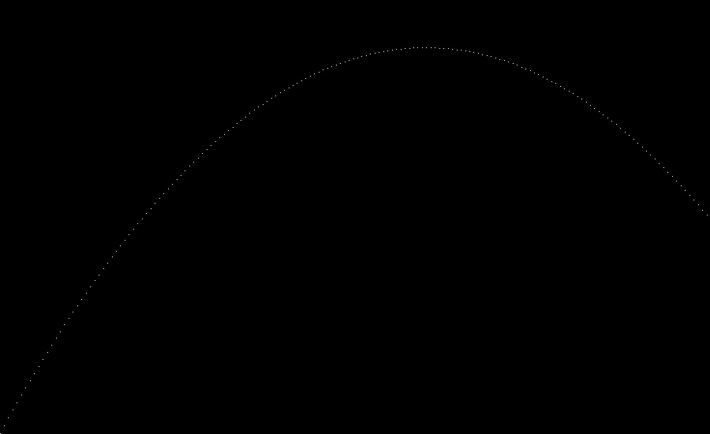

# Go Renderer

This is an implementation of [The Ray Tracer Challenge](https://pragprog.com/titles/jbtracer/the-ray-tracer-challenge/) By Jamis Buck using Go.

The project is managed using Makefile so all the commands can be run using `make`

```bash
# Run all the tests
make test

# Build the code
make build

# Run the app
make run

# remove any artifacts
make clean
```

## Results

| Chapter | Description   | Output                                             |
| ------- | ------------- | -------------------------------------------------- |
| 1       | Vector Math   |                                                    |
| 2       | Canvas output |  |
